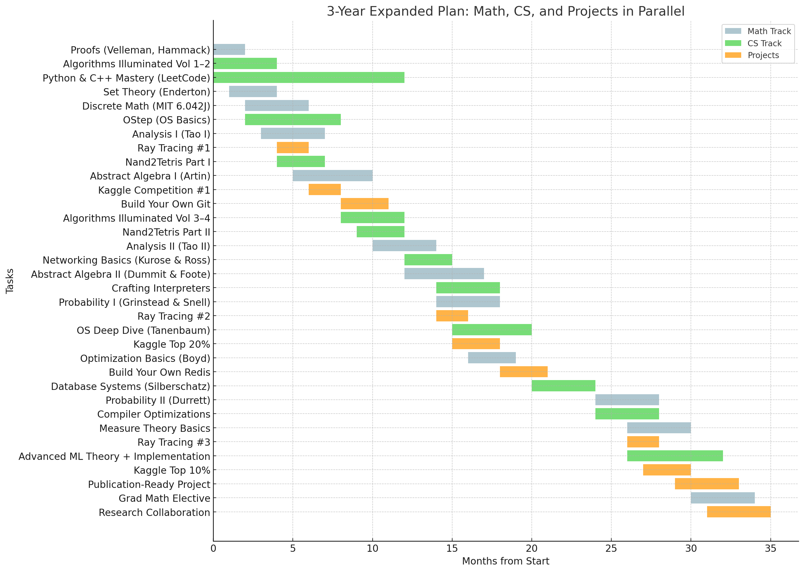

<!--
**k-tro/k-tro** is a ✨ _special_ ✨ repository because its `README.md` (this file) appears on your GitHub profile.

Here are some ideas to get you started:

- 🔭 I’m currently working on ...
- 🌱 I’m currently learning ...
- 👯 I’m looking to collaborate on ...
- 🤔 I’m looking for help with ...
- 💬 Ask me about ...
- 📫 How to reach me: ...
- 😄 Pronouns: ...
- ⚡ Fun fact: ...
-->

# Hey there! I'm Piyush

I'm a self-driven developer with a background in Aerospace Engineering and a deep commitment to learning and building. After overcoming some major personal hurdles, I'm now back on the track to learn things and find inner peace... and try to get into a good job/university.

Here's a rough guideline that I am following, starting August 2025:

Note: this was given to me by GPT5 after I told it a list of things I plan to do. My own plan may vary. I will be updating my page to show the correct plan.

## What I'm Doing Now
-  Velleman proofs, Algorithms, DSA on leetcode, learning Rust.
-  Documenting my journey on [my learning site](https://k-tro.github.io)
-  Building real projects in **Python**, **C++** and **Rust**

## Current Skillset
- Languages: `C++ (STL)`, `Python (np, pd, torch)`, `Java (base)`
- Tools: `Git`, `WSL2`, `VS Code`, `Obsidian`
- Concepts: OOP, DSA, MLPs, Engineering Math (UG)

## Goals
- Join a good intern/job soon.
- Build a portfolio of **deployable, useful software**
- Eventually explore advanced topics in ML, statistics, and systems
- ~~Design a machine learning workflow for Aerospace Engineering solutions~~

## Let's Connect!
-  [LinkedIn](https://linkedin.com/in/ktroo)
-  [My Website](https://k-tro.github.io)
-  Email: ktroc3@gmail.com

---

Regardless of how you ended up here, I am willing to talk about music, physics, math, and cats. 
